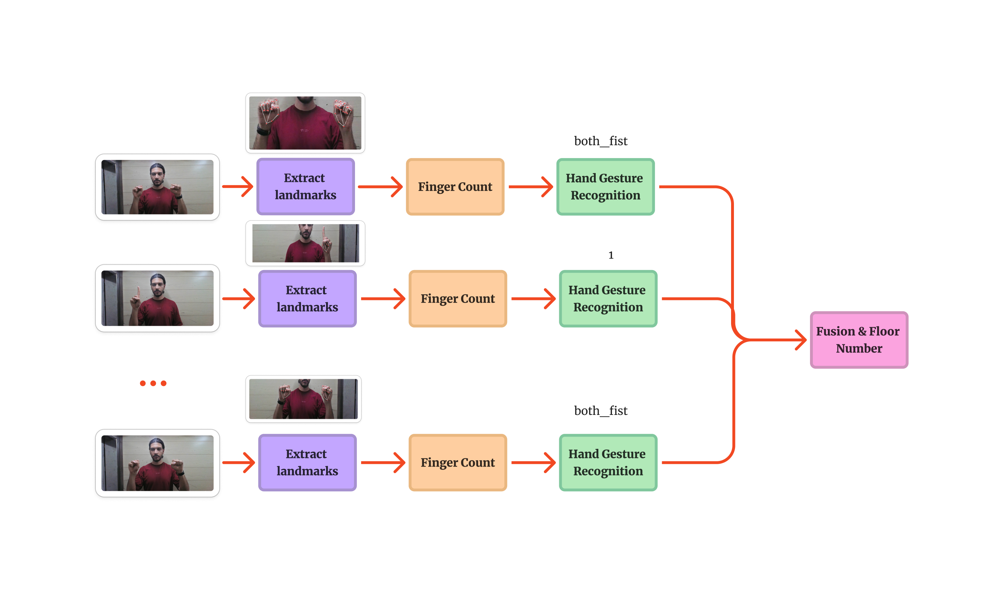
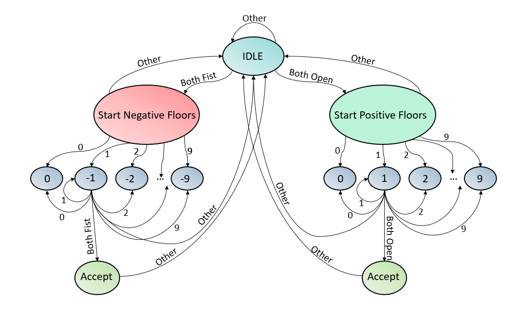
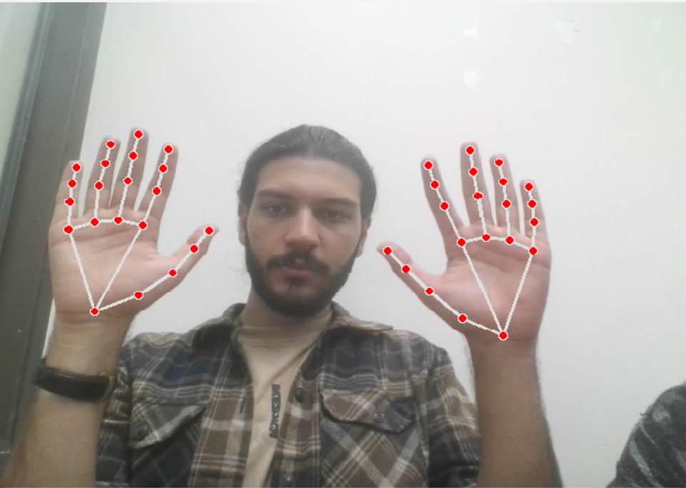
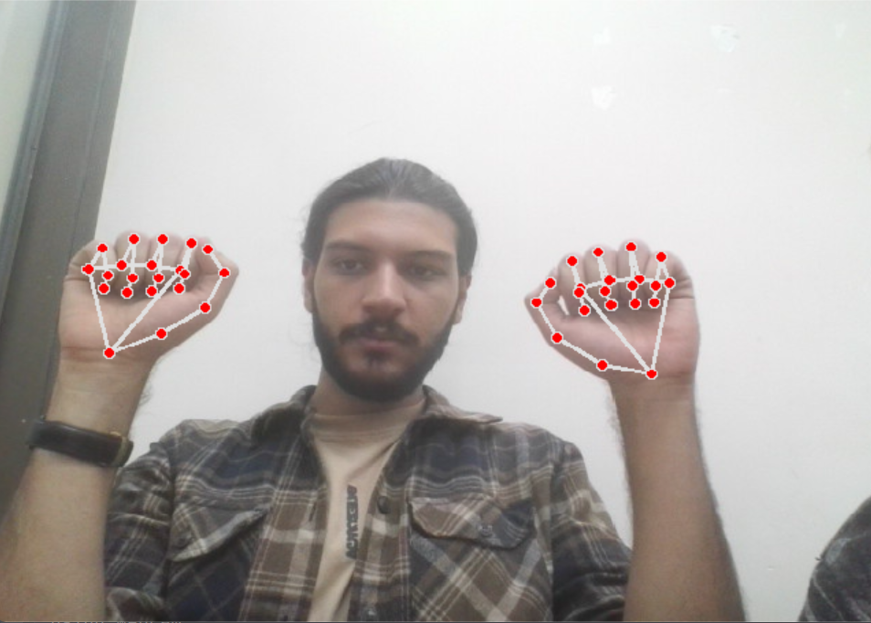
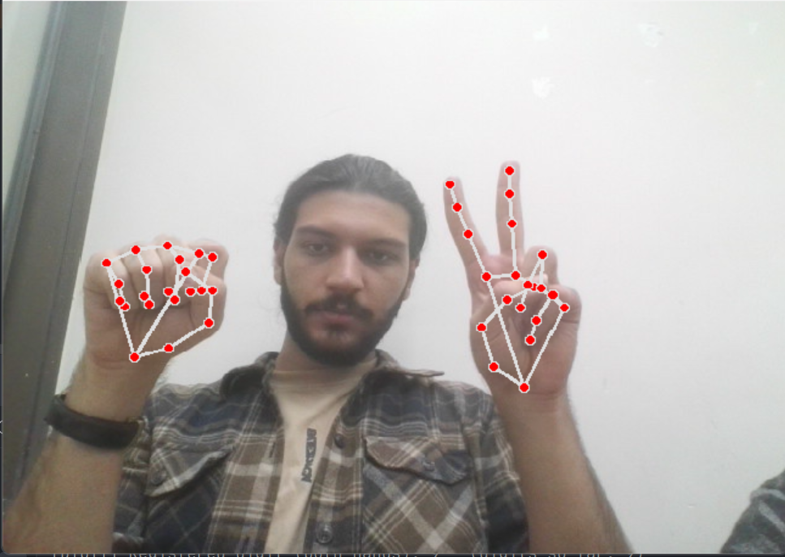
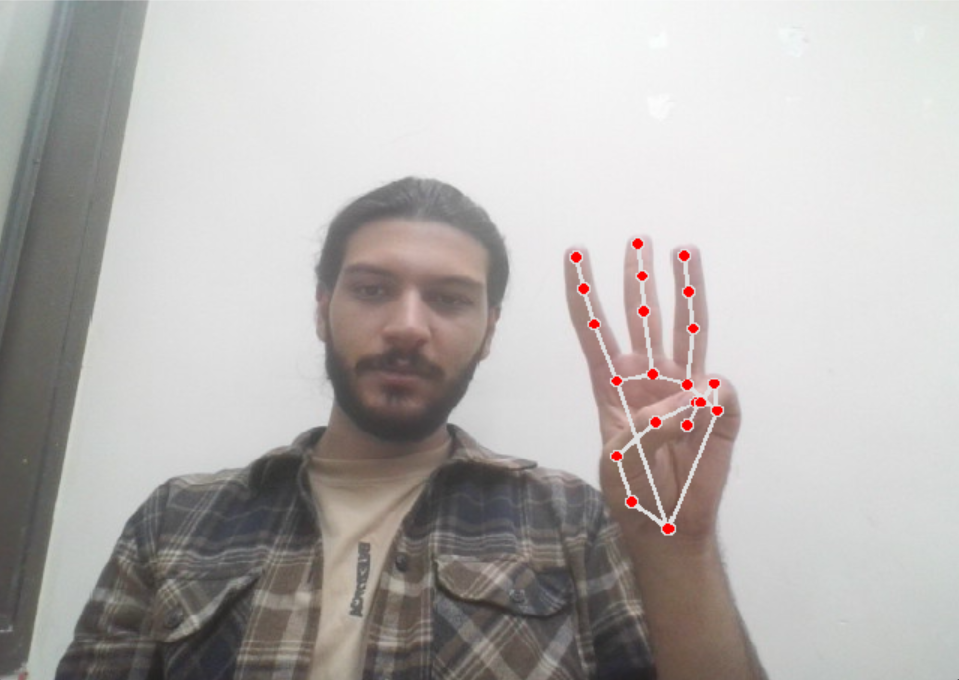
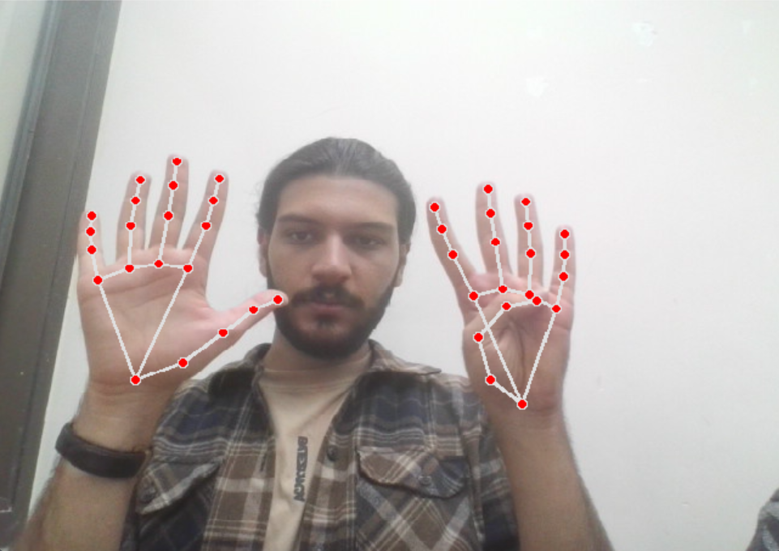

# Gesture-Based Elevator Control System for Real-Time Floor Selection

This repository implements a real-time, touchless elevator floor-selection system that recognizes hand gestures using MediaPipe hand landmarks and a lightweight heuristic state machine. The system fuses single- and two-hand gestures, uses hold-time logic to avoid accidental activations, and was evaluated on a 70-video dataset (reported overall accuracy ≈ 91.4%). See the full paper for design details and figures: `Gesture-Based Elevator Control System for Real-Time Floor Selection.pdf`.

---

## Table of contents

* [Quick demo (figures)](#quick-demo-figures)
* [Overview](#overview)
* [Highlights](#highlights)
* [Requirements](#requirements)
* [Quick start](#quick-start)
* [How it works (concise)](#how-it-works-concise)

  * [Processing pipeline](#processing-pipeline)
  * [State machine](#state-machine)
  * [Gesture vocabulary & examples](#gesture-vocabulary--examples)
* [Key configuration parameters](#key-configuration-parameters)
* [Project structure (recommended)](#project-structure-recommended)
* [Reported evaluation (from the paper)](#reported-evaluation-from-the-paper)
* [Limitations & safety notes](#limitations--safety-notes)
* [Suggested next steps / productionization](#suggested-next-steps--productionization)
* [Citation & license](#citation--license)

---

## Quick demo (figures)

**Processing pipeline**



**State machine** — how gestures are confirmed to become floor numbers



**Gesture examples (MediaPipe landmark overlays)**

<div align="center">
  
  
  
  <br/>
  
  
</div>


---

## Overview

This project implements a touchless method for selecting elevator floors using hand gestures. It leverages MediaPipe to get 21 hand landmarks per hand, applies a hybrid heuristic to infer which fingers are “up” (open) or “down” (closed), and then uses a small temporal state machine (with `HOLD_TIME` rules) to reduce accidental activations and confirm the user’s intent before triggering an action.

The provided `main.py` runs in real time, visualizes landmarks and state, and calls `simulate_move(floor_str)` when a floor selection is confirmed — `simulate_move()` currently prints/logs the selection and can be replaced with a real elevator API call.

---

## Highlights

* Real-time single- and two-hand gesture detection
* Robust thumb detection using handedness + palm-orientation check
* Temporal smoothing and hold-time based state machine to avoid accidental selections
* Tested on multiple elevator scenes, including gloved hands scenarios
* Easy to extend to real elevator hardware via `simulate_move()`

---

## Requirements

* Python 3.8+
* `opencv-python`
* `mediapipe`

Install dependencies:

```bash
pip install opencv-python mediapipe
```
---

## Quick start

1. Clone or copy the repo into a working folder.
2. Ensure the paper and images are placed under `images/`.
3. Run the script:

```bash
python main.py
```

The script opens the default camera (`CAM_ID = 0`) and draws landmarks/state overlays on the frame. Press `Esc` to exit.

To run on a pre-recorded video, change the video capture source in `main.py`:

```python
cap = cv2.VideoCapture(r"path/to/test_video.mp4")
```

---

## How it works (concise)

### Processing pipeline

1. Capture frame → convert to RGB.
2. MediaPipe Hand model extracts 21 landmarks per detected hand.
3. `fingers_up_final_hybrid` (heuristic): uses tip↔PIP/wrist distances normalized by palm size + handedness/palm-facing checks to decide each finger’s state.
4. `interpret_gesture`: maps finger-state patterns (single-hand or fused two-hand patterns) to digits or special tokens (`both_open`, `both_fist`, `undefined`).
5. State machine: uses `HOLD_TIME` thresholds and neutral/debounce periods to confirm user intent (see state-machine diagram above).
6. On confirm → `simulate_move(floor_str)` is called.

### State machine

* **IDLE**: waiting for a clear `both_open` or `both_fist` to start positive/negative listening.
* **POSITIVE_LISTEN / NEGATIVE_LISTEN**: accumulate digits as user holds gestures; transitions use time thresholds (`HOLD_TIME`, `HOLD_TIME_ZERO`).
* **ACCEPT**: when finished, dispatch the floor selection and reset to IDLE (with a neutral hold to avoid double-trigger).

See the embedded state machine diagram for full transitions.

### Gesture vocabulary & examples

* `single_X` — a single hand showing digit X (0–9).
* `both_open` / `both_fist` — both hands open or both hands in fist used as modes to start/finish entry.
* Two-hand fusion logic allows multi-digit inputs.

Examples of representative frames with landmarks are shown above in the **Gesture examples** gallery.

---

## Key configuration parameters

These are defined and tunable in `main.py`:

* `CAM_ID = 0` — camera index
* `UNDEFINED_HOLD_TIME = 2.0` — time to hold for undefined/uncertain gestures
* `HOLD_TIME = 0.4` — default hold-to-confirm time for digits
* `HOLD_TIME_ZERO = 1.0` — longer hold for `0` / fist (to reduce 0↔1 mistakes)
* `NEUTRAL_HOLD_TIME = 0.1` — short neutral debounce
* MediaPipe confidences: `min_detection_confidence = 0.7`, `min_tracking_confidence = 0.5`

Tune these values depending on camera distance, lighting, and expected user behavior.

---

## Reported evaluation (from the paper)

* **Dataset**: 70 videos, 4 different elevator environments (includes gloved-hand scenarios).
* **Overall accuracy**: ~91.42% (64/70 successful runs).
* **Glove-specific accuracy**: ~85.71%.
* **By length**: single-digit 96%, two-digit 95.65%, three-digit 81.81%.


---

## Limitations & safety notes

* **0 ↔ 1 confusion** (fist vs thumb) is the most common error; code includes heuristics to mitigate it but it may still occur.
* **Lighting and motion blur** can cause landmark dropout; smoothing and temporal filtering help but are not perfect.
* **Production hardware**: the current `simulate_move()` is a stub — connecting to a real elevator must include authentication, safety interlocks, and multi-party validation (do **not** directly connect to elevators without safety engineering and verification).
* Test thoroughly under real-world conditions (different users, camera heights, hand sizes, gloves, occlusions) before any deployment.

---

## Suggested next steps / productionization

* Replace `simulate_move()` with a secure elevator API (HTTP/MQTT/serial) and add authentication + safety checks.
* Add logging (file-based) and CSV export of recognized sequences for offline analysis.
* Add unit tests for the heuristic functions using synthetic landmark inputs.
* Consider a lightweight temporal model (e.g., 1D-CNN or small LSTM) to further reduce transient misclassifications.
* Expand dataset for more lighting, ethnicities, gloves, and camera positions.

---

## Citation & license

This project is licensed under the MIT License - see the [LICENSE](LICENSE) file for details.

```
MIT License

Copyright (c) 2024 Kian

Permission is hereby granted, free of charge, to any person obtaining a copy
of this software and associated documentation files (the "Software"), to deal
in the Software without restriction, including without limitation the rights
to use, copy, modify, merge, publish, distribute, sublicense, and/or sell
copies of the Software, and to permit persons to whom the Software is
furnished to do so, subject to the following conditions:

The above copyright notice and this permission notice shall be included in all
copies or substantial portions of the Software.

THE SOFTWARE IS PROVIDED "AS IS", WITHOUT WARRANTY OF ANY KIND, EXPRESS OR
IMPLIED, INCLUDING BUT NOT LIMITED TO THE WARRANTIES OF MERCHANTABILITY,
FITNESS FOR A PARTICULAR PURPOSE AND NONINFRINGEMENT. IN NO EVENT SHALL THE
AUTHORS OR COPYRIGHT HOLDERS BE LIABLE FOR ANY CLAIM, DAMAGES OR OTHER
LIABILITY, WHETHER IN AN ACTION OF CONTRACT, TORT OR OTHERWISE, ARISING FROM,
OUT OF OR IN CONNECTION WITH THE SOFTWARE OR THE USE OR OTHER DEALINGS IN THE
SOFTWARE.
```

