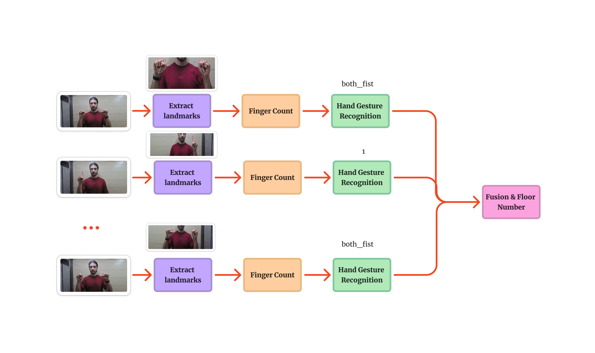
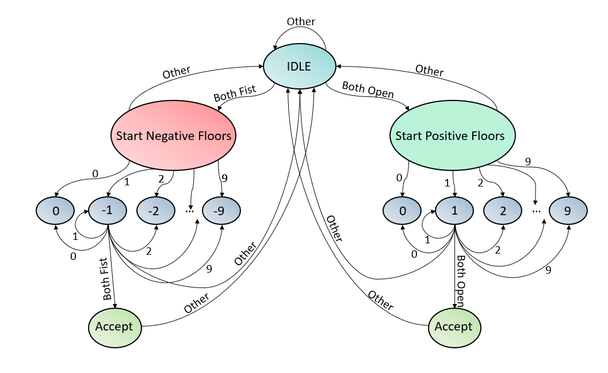
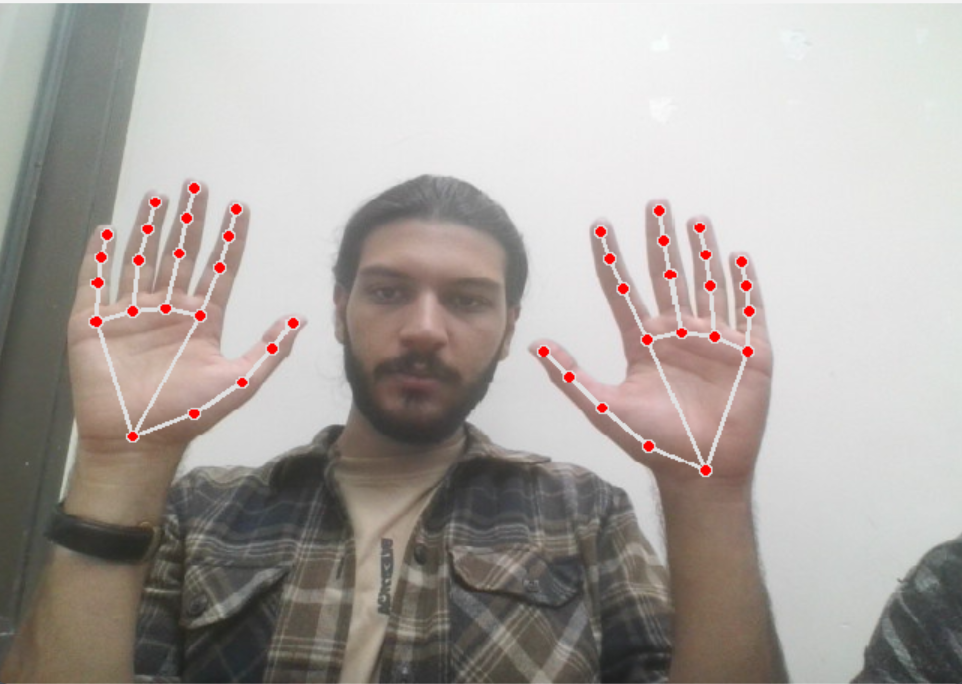
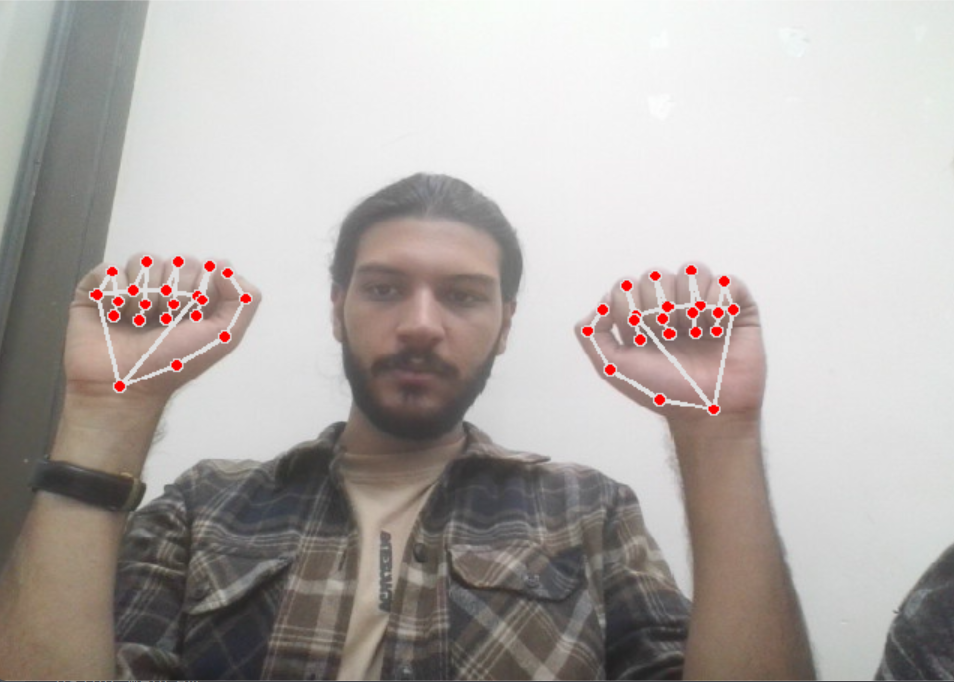
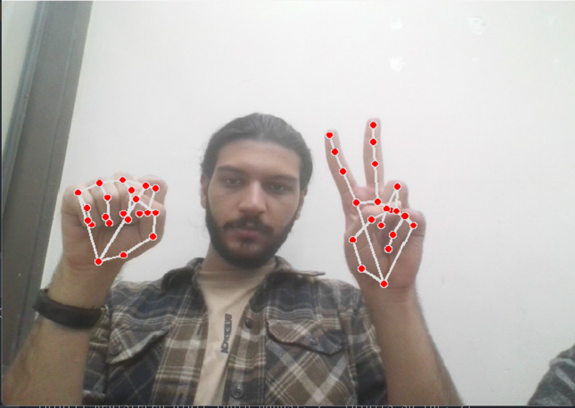
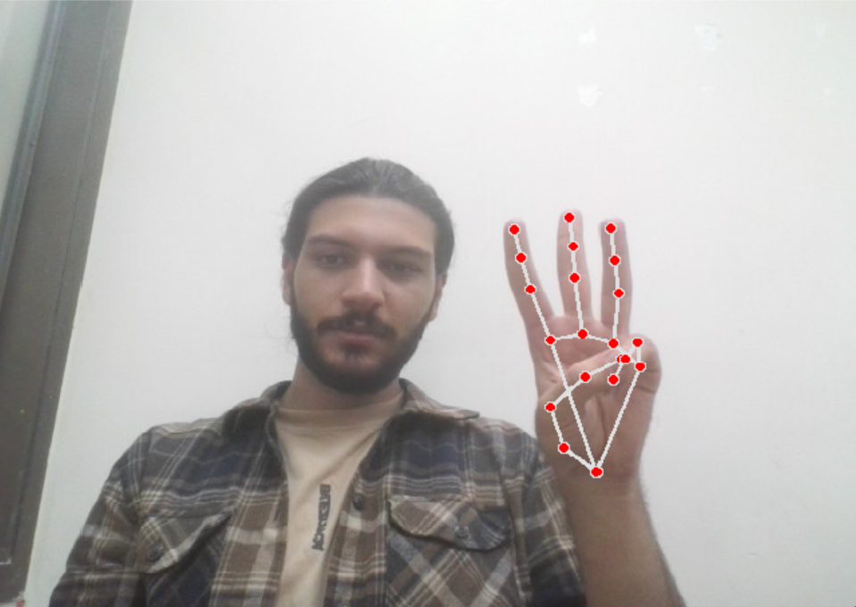
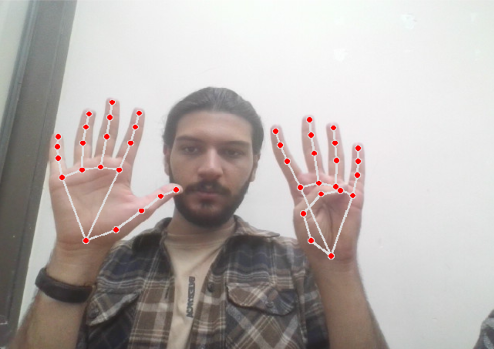

# Gesture-Based Elevator Control System for Real-Time Floor Selection

A real-time, touchless elevator floor-selection system based on hand landmarks, lightweight geometric heuristics, temporal smoothing, and a finite-state interaction model.

The implementation accompanies the paper **“Gesture-Based Elevator Control System for Real-Time Floor Selection”**, presented at the **10th International Congress on Fuzzy and Intelligent Systems (CFIS 2025)**.

**Paper DOI:** [10.1109/CFIS68949.2025.11652063](https://doi.org/10.1109/CFIS68949.2025.11652063)  
**Author:** Kian Shojaei  
**Supervisor:** Elham Shabaninia

---

## Research Overview

The system provides a contactless method for selecting positive and negative elevator floors through hand gestures. It is designed around a lightweight, interpretable pipeline rather than a large end-to-end neural classifier.

The implementation combines:

- **MediaPipe Hands** for real-time 21-point hand landmark extraction
- **Handedness- and palm-orientation-aware thumb detection**
- **Hybrid finger-state heuristics** for the remaining fingers
- **Single- and two-hand gesture aggregation**
- **Short-term temporal smoothing** using a history buffer
- **Hold-time confirmation** to reduce transient detections
- **A finite-state machine** for positive/negative floor entry and command finalization
- A simulation layer that prints the selected floor instead of controlling physical elevator hardware

The complete system was evaluated in the accompanying paper on a custom dataset of **70 annotated videos recorded across four elevator environments**.

---

## System Pipeline

The runtime flow is:

`Camera → RGB conversion → MediaPipe Hands → Landmark analysis → Finger-state estimation → Gesture interpretation → Temporal smoothing → State machine → Floor selection`



The pipeline deliberately separates perception from interaction logic, making the implementation easier to inspect and extend.

---

## State Machine

The interaction is organized around three primary states:

- **IDLE** — waiting for a mode-selection gesture
- **POSITIVE_LISTEN** — collecting digits for a positive floor
- **NEGATIVE_LISTEN** — collecting digits for a negative floor

A sustained **both-open** gesture starts or finalizes positive-floor entry, while a sustained **both-fist** gesture starts or finalizes negative-floor entry.



The implementation also uses neutral/debounce periods and gesture-specific hold times to reduce repeated registration of the same gesture.

---

## Gesture Vocabulary

| Gesture | Meaning |
|---|---|
| `both_open` | Start/finalize positive-floor input |
| `both_fist` | Start/finalize negative-floor input |
| `single_0` … `single_5` | Single-hand digits 0–5 |
| `both_6` … `both_9` | Two-hand digit encodings 6–9 |
| `undefined` | Ambiguous or unsupported configuration |
| `no_hand` | No hand detected |

### Representative Gesture Frames

All gesture figures originally included with the project are retained and used below.

**Both hands open**



**Both hands in a fist**



**Undefined / ambiguous gesture**



**Digit 3**



**Digit 9**



---

## Implementation Details

### Hand Landmark Processing

The four non-thumb fingers are evaluated using a wrist-relative distance comparison:

`d(tip, wrist) > d(PIP, wrist)`

The thumb is handled separately because its motion is more sensitive to handedness and palm orientation.

The implementation combines MediaPipe handedness, palm/back-of-hand orientation, thumb geometry, wrist-relative finger distances, and a secondary fist heuristic.

### Temporal Filtering

The raw gesture prediction is stored in a short history buffer:

`deque(maxlen=5)`

The most frequent recent token is used as the current gesture, followed by gesture-specific hold-time confirmation.

This separates frame-level recognition from interaction-level confirmation.

---

## Configuration

The current values in `main.py` are:

| Parameter | Value | Purpose |
|---|---:|---|
| `CAM_ID` | `0` | Default camera index |
| `UNDEFINED_HOLD_TIME` | `2.0` s | Confirmation period for undefined gestures |
| `HOLD_TIME` | `0.48` s | Default gesture confirmation time |
| `HOLD_TIME_ZERO` | `1.0` s | Longer confirmation for digit 0 |
| `NEUTRAL_HOLD_TIME` | `0.1` s | Neutral/debounce interval |
| `max_num_hands` | `2` | Maximum simultaneous hands |
| `min_detection_confidence` | `0.7` | MediaPipe detection threshold |
| `min_tracking_confidence` | `0.5` | MediaPipe tracking threshold |

---

## Installation

```bash
pip install -r requirements.txt
```

## Running the System

```bash
python main.py
```

The application opens the configured camera, detects hands, draws landmarks, estimates gestures, applies temporal smoothing, updates the state machine, and displays the current interaction state.

Press **Esc** to exit.

### Hardware Interface

The current `simulate_move()` function is a simulation layer. It reports the requested floor and **does not control physical elevator hardware**.

A real hardware integration would require independently engineered control logic, authentication, safety interlocks, fault handling, logging, and validation.

---

## Dataset

The evaluation dataset contains **70 annotated videos** recorded across four elevator environments, including positive and negative floors, multi-digit selections, and gloved-hand samples.

See [DataSet/README.md](DataSet/README.md) for dataset access information.

---

## Reported Evaluation

The following results are **reported in the accompanying paper**.

| Evaluation condition | Reported accuracy |
|---|---:|
| Positive-floor samples | 94.44% |
| Negative-floor samples | 88.23% |
| Glove samples | 85.71% |
| Overall | **91.42%** |

| Floor-number length | Reported accuracy |
|---|---:|
| Single digit | 96.00% |
| Two digits | 95.65% |
| Three digits | 81.81% |


---

## Limitations and Observed Failure Modes

- The reported evaluation identified several recurring failure modes, including confusion between closed-fist and thumb-up poses (0 vs. 1), intermittent thumb misclassification, missed gesture finalization when the hand briefly leaves the camera frame, and landmark dropouts caused by motion blur or extreme lighting.

- Multi-digit requests can amplify individual recognition errors because a single misclassified digit propagates into the final floor sequence. The evaluation was conducted on a custom dataset of 70 videos, and the paper discusses the need for a larger and more diverse validation set, including additional glove, low-light, and borderline-pose examples.

- The current implementation uses a placeholder routine for the elevator-control interface rather than directly controlling physical elevator hardware. Future work also includes improving person-to-hand association and developing more robust deployment and validation procedures.

---

## Future Work

Future directions discussed in the paper include improved thumb/fist discrimination, adaptive palm-size scaling, larger and more diverse datasets, stronger temporal modeling, improved person-to-hand association, and secure elevator-interface integration.

---

## Repository Structure

```text
Elevator-Control/
├── main.py
├── requirements.txt
├── LICENSE
├── DataSet/
│   └── README.md
└── images/
    ├── Pipeline_Sequence_Diagram.jpg
    ├── state_machine.png
    ├── both_open.png
    ├── both_fist.png
    ├── undefined.png
    ├── 3.png
    └── 9.png
```

---

## Paper

The complete paper is included with the repository:

[IEEE Xplore / DOI](https://doi.org/10.1109/CFIS68949.2025.11652063)

**Citation**

> K. Shojaei and E. Shabaninia, “Gesture-Based Elevator Control System for Real-Time Floor Selection,” in *2025 10th International Congress on Fuzzy and Intelligent Systems (CFIS)*, 2025, doi: 10.1109/CFIS68949.2025.11652063.

---

## License

This project is released under the [MIT License](LICENSE).
